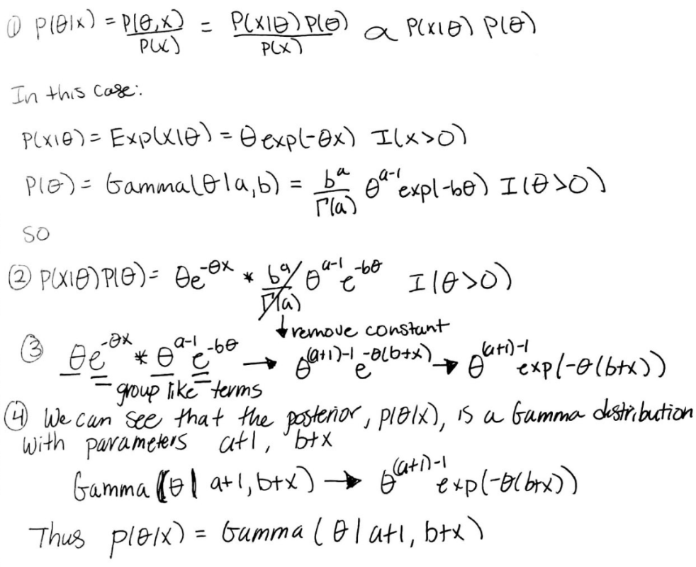

```{r set-up, message = FALSE}
library(tidyverse) #load in tidyverse package
```
# Lab Component

a. Task 3
```{r Task-3, echo = TRUE}
set.seed(123)
### Bernoulli LH Function ###
# Input: obs.data, theta
# Output: bernoulli likelihood
obs.data <- rbinom(n = 100, size = 1, prob = 0.01)
bernLH <- function(obs.data, theta){
  N <- length(obs.data)
  x <- sum(obs.data)
  LH <- (theta ^x) *((1-theta)^{N-x})
  return (LH)
}

### Plot LH for a grid of theta values ###
# Create the grid #
theta.sim <- seq(from = 0, to = 1, length.out = 1000)
# Store the LH values
sim.LH <- bernLH(obs.data, theta = theta.sim)
# Create the Plot
plot(theta.sim, sim.LH, type = "l", main = "Likelihood Profile", 
     xlab = "Simulated Support", 
     ylab = "Likelihood")
```

b. Task 4
```{r Task-4, echo = TRUE}
myBetaBernoulli <- function(obs.data, theta, a, b){
  N <- length(obs.data)
  x <- sum(obs.data)
  BeBern <- dbeta(theta, x + a, N-x+b)
  param1= x+a
  param2 = N-x+b
  print(param1)
  print(param2)
  return(BeBern)
}

non.informative.prior <- dbeta(theta.sim,1,1)
informative.prior <- dbeta(theta.sim,3,1)

posterior.non.informative <- myBetaBernoulli(obs.data, theta.sim, 1, 1)
posterior.informative <- myBetaBernoulli(obs.data, theta.sim, 3, 1)
```
The parameters for the posterior with a non-informative prior are Beta(2, 100) and for the informative, the parameters are Beta(4, 100).

c. Task 5

```{r Task-5}
df<- data.frame(theta.sim, non.informative.prior, informative.prior, sim.LH)
ggplot(df, aes(theta.sim)) + 
  geom_line(aes(y=sim.LH, color="Likelihood")) +
  geom_line(aes(y=non.informative.prior,
                color= "Non-Informative Prior")) +  
  geom_line(aes(y=posterior.non.informative, color="Posterior"))+
  scale_color_manual(name = "Distributions",
     breaks = c("Likelihood","Non-Informative Prior",
                "Posterior"),
     values = c("red", "green","blue"))+
labs(title = "Likelihood, Posterior, Non-Informative Prior",
       y = "Density",
       x = "Theta" ) +
  theme(
    panel.grid.major = element_blank(),
    panel.grid.minor = element_blank(),
  ) 


ggplot(df, aes(theta.sim)) + 
  geom_line(aes(y=sim.LH, color="Likelihood")) +
  geom_line(aes(y=informative.prior,
                color= "Informative Prior")) +  
  geom_line(aes(y=posterior.informative, color="Posterior"))+
  scale_color_manual(name = "Distributions",
     breaks = c("Likelihood","Informative Prior",
                "Posterior"),
     values = c("red", "green","blue"))+
labs(title = "Likelihood, Posterior, Informative Prior",
       y = "Density",
       x = "Theta" ) +
  theme(
    panel.grid.major = element_blank(),
    panel.grid.minor = element_blank(),
  ) 
```

We can see that the informative prior is slightly more to the right than the non-informative prior. Having an informative prior shifted the posterior distribution so the value of theta it's centered about is greater than the non-informative prior posterior distribution. We can also see that the non-informative distribution is taller than the informative

# The Exponential-Gamma Model
a. 
    
b. The posterior distribution is a proper density distribution function because it is an actual probability distribution, a Gamma distribution. Improper distributions are functions that do not integrate to 1. In this case, the Gamma distribution with parameters (a + 1, b + x) integrates to 1 with respect to theta.

c.
```{r create-prior-posterior}
q2.obs.data <- c(20.9, 69.7, 3.6, 21.8, 21.4, 0.4, 6.7, 10.0)
q2.theta <- seq(from = 0.4, to = 69.7, length.out = 1000)
x <-sum(q2.obs.data)
alpha = 0.1
beta = 1.0
alpha2 = 0.1 + length(q2.obs.data)
beta2 = 1.0 + x
q2.prior <- dgamma(x = q2.theta, alpha , rate = 1.0/beta)
q2.posterior <-dgamma(x = q2.theta, alpha2, rate = 1.0/beta2)
df2<-data.frame(q2.theta, q2.prior, q2.posterior)
ggplot(df2, aes(x = q2.theta)) + 
  geom_line(aes(y=q2.prior, color="Prior")) +
  geom_line(aes(y=q2.posterior,
                color= "Posterior")) +  
  scale_color_manual(name = "Distributions",
     breaks = c("Prior",
                "Posterior"),
     values = c("red", "green"))+
labs(title = "Posterior and Prior",
       y = "Density",
       x = "Theta" )

```