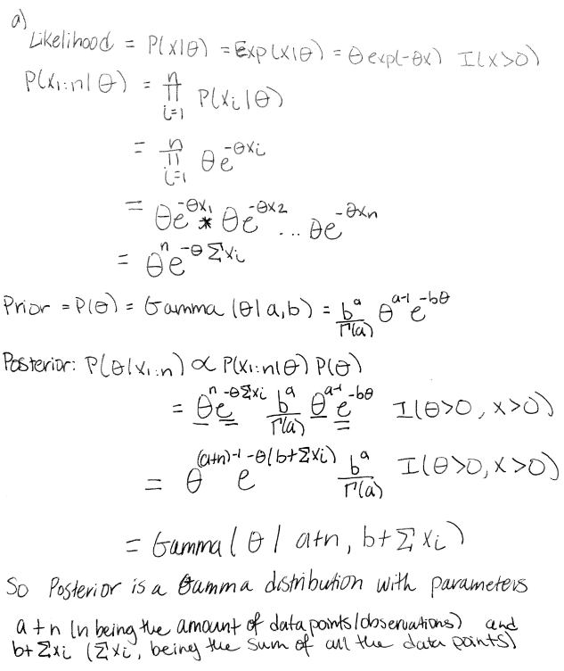
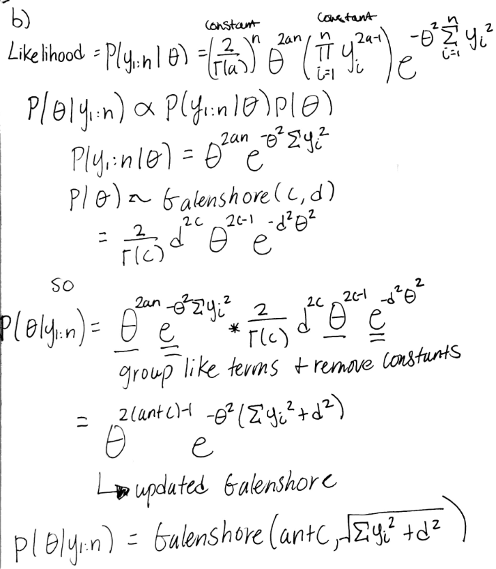
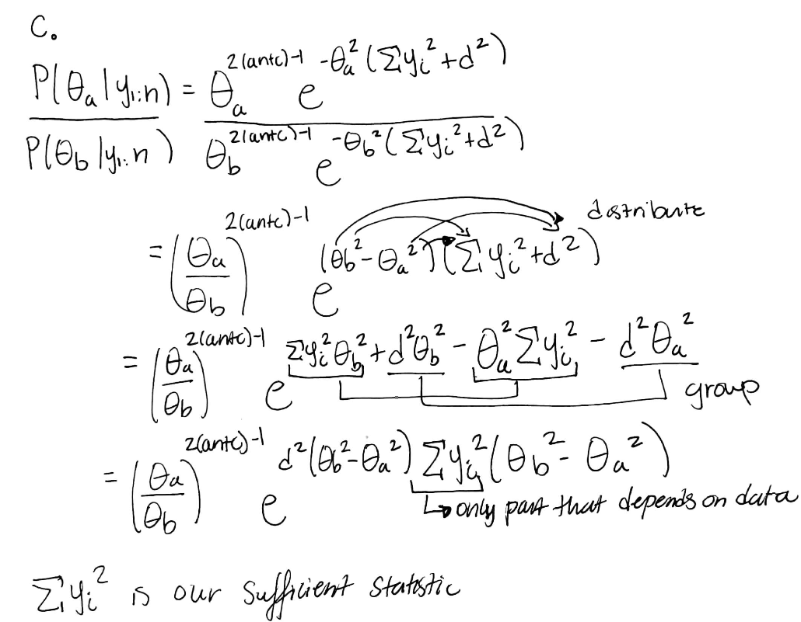
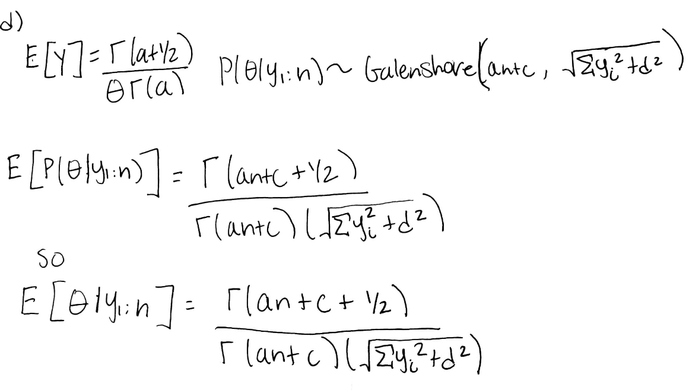
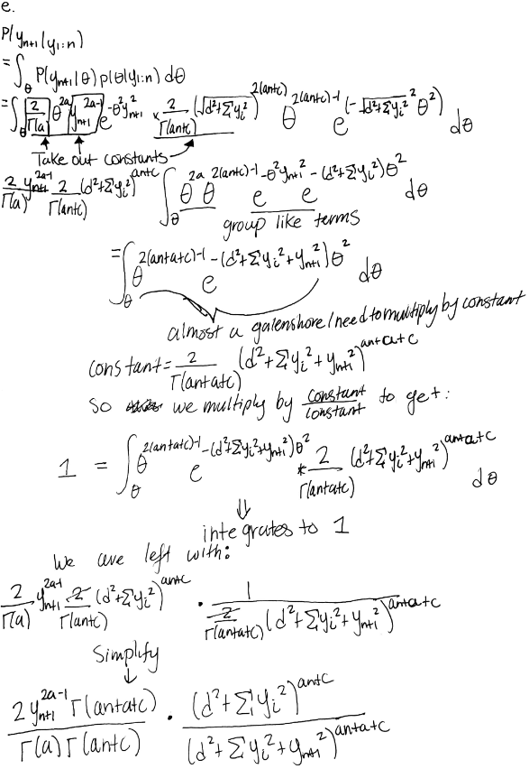

```{r set-up, message = FALSE}
library(tidyverse) #load in tidyverse package
```
# Lab Component

a. Task 3
```{r Task-3, echo = TRUE}
set.seed(123)
# Bernoulli LH Function
# Input: obs.data, theta
# Output: bernoulli likelihood
obs.data <- rbinom(n = 100, size = 1, prob = 0.01) #create observation data
bernLH <- function(obs.data, theta){
  N <- length(obs.data) #set N to be the length
  x <- sum(obs.data) #set x to the be the sum of the observation data
  LH <- (theta ^x) *((1-theta)^{N-x}) #plug in values according to Bernoulli
  return (LH)
}

# Plot LH for a grid of theta values
# Create the grid #
theta.sim <- seq(from = 0, to = 1, length.out = 1000)
# Store the LH values
sim.LH <- bernLH(obs.data, theta = theta.sim)
# Create the Plot
df <- data.frame(theta.sim, sim.LH)
ggplot(df, aes(theta.sim)) + 
  geom_line(aes(y=sim.LH)) +
labs(title = "Likelihood Profile",
       y = "Likelihood",
       x = "Simulated Support" ) +
    theme(
    panel.grid.major = element_blank(), #erase the grid lines for easier view
    panel.grid.minor = element_blank(),
    ) 
```

b. Task 4
```{r Task-4, echo = TRUE}
#Create Beta-Bernoulli Function
posteriorParamters <- function(obs.data,a, b){ 
  N <- length(obs.data)
  x <- sum(obs.data)
  a.post = a + x
  b.post = N - x + b
  print(c(a.post, b.post))
  return(c(a.post, b.post))
}
parameters.non.informative <-posteriorParamters(obs.data, 1, 1)
parameters.informative <-posteriorParamters(obs.data, 3, 1)

```
The parameters for the posterior with a non-informative prior are Beta(2, 100) and for the informative, the parameters are Beta(4, 100).

c. Task 5

```{r Task-5}
#Plug in values for non-informative prior
non.informative.prior <- dbeta(theta.sim,1,1)
#Plug in values for informative prior
informative.prior <- dbeta(theta.sim,3,1)
#Get Posterior distribution using parameters produced above
posterior.non.informative <- dbeta(theta.sim,
                              parameters.non.informative[1],
                              parameters.non.informative[2])
posterior.informative <- dbeta(theta.sim, 
                               parameters.informative[1],
                               parameters.informative[2])

#Create data frame with the values we plan on plotting
df<- data.frame(theta.sim, sim.LH, non.informative.prior, informative.prior,
                posterior.informative, posterior.non.informative)
#Create Graph for Non-Informative
ggplot(df, aes(theta.sim)) +  #theta.sim is our x values
  geom_line(aes(y=sim.LH, color="Likelihood")) + #likelihood as y
  geom_line(aes(y=non.informative.prior, #non-informative prior
                color= "Non-Informative Prior")) +  
  geom_line(aes(y=posterior.non.informative,  # posterior
                color="Posterior"))+ 
  scale_color_manual(name = "Distributions", #create legend 
     breaks = c("Likelihood","Non-Informative Prior",
                "Posterior"),
     values = c("red", "green","blue"))+ #set colors
labs(title = "Likelihood, Posterior, Non-Informative Prior",
       y = "Density",
       x = "Theta" ) +
  theme(
    panel.grid.major = element_blank(), #remove grid for easier view
    panel.grid.minor = element_blank(),
  ) 
#Create Graph for Informative
ggplot(df, aes(theta.sim)) + #set theta.sim as x values
  geom_line(aes(y=sim.LH, color="Likelihood")) + #likelihood
  geom_line(aes(y=informative.prior, #informative prior
                color= "Informative Prior")) +  
  geom_line(aes(y=posterior.informative,  #posterior
                color="Posterior"))+
  scale_color_manual(name = "Distributions", #setting legend
     breaks = c("Likelihood","Informative Prior",
                "Posterior"),
     values = c("red", "green","blue"))+ #set line colors
labs(title = "Likelihood, Posterior, Informative Prior",
       y = "Density",
       x = "Theta" ) +
  theme(
    panel.grid.major = element_blank(), #remove grid for easier view
    panel.grid.minor = element_blank(),
  ) 
```
  

Here we can see that the "non-informative" prior is a uniform distribution and ironically it's pretty informative as it's able to shift the posterior more to the right as well as making the posterior distribution much more narrow as compared to the "informative" prior's posterior. The informative prior's posterior is centered more to the left and is wider compared to the non-informative posterior. The informative posterior is also not as tall as the non-informative posterior, with the peak at a density between 20-30 while the non-informative posterior's peak is at a density between 30 and 40. 

# The Exponential-Gamma Model
a. 
    
b. The posterior distribution is a proper density distribution function because it is an actual probability distribution, a Gamma distribution. Improper distributions are functions that do not integrate to 1. In this case, the Gamma distribution with parameters (a + n, b + sum of (xi)) integrates to 1 with respect to theta.

c.
```{r create-prior-posterior}
#Create Vector of Data Provided from question
q2.obs.data <- c(20.9, 69.7, 3.6, 21.8, 21.4, 0.4, 6.7, 10.0) 
#Sum the observation values
x <-sum(q2.obs.data)
#Get prior using gamma distribution
q2.prior <- dgamma(x = theta.sim, 0.1, rate = 1.0)
#Get Posterior using Gamma distribution with derived parameters 
q2.posterior <-dgamma(x = theta.sim, shape = 0.1 + length(q2.obs.data), 
                      rate = 1.0+x)
#Create Data Frame for Plotting Purposes
df2<-data.frame(theta.sim, q2.prior, q2.posterior)
#Create Graph with both Prior and Posterior
ggplot(df2, aes(x = theta.sim)) + 
  geom_line(aes(y=q2.prior, color="Prior")) + #graph the prior
  geom_line(aes(y=q2.posterior, #graph the posterior
                color= "Posterior")) +  
  scale_color_manual(name = "Distributions", #create legend
     breaks = c("Prior",
                "Posterior"),
     values = c("red", "green"))+ #set colors
labs(title = "Posterior and Prior",
       y = "Density",
       x = "Theta" )+
  ylim(0,30) #set limitation on y-axis for better view
```

d. An application where an exponential model would be reasonable would be using to model the time between events such as the time until the next call at a call center or the amount of time a storekeeper must wait before the next customer comes. The events must be "memoryless", for the exponential distribution to be a reasonable choice. The time between events do not depend on how much time has elapsed already. 
So a situation that would be inappropriate for the exponential distribution to be used would be a situation where the variable does depend on how much time has elapsed. For example, modeling the lifetime of a car engine, X, with X being how many miles can be driven before the engine breaks down or how long till the engine breaks down. Here, by intuition, the longer you have driven the car, the more miles and time spent using the engine, the more likely an engine will break down so an engine that has been used for 6 years and has driven 100,000 miles will have a lower X than an engine that has been only used for a month and has only driven 500 miles. Here, the probability that the engine will break down is not independent of the fact that it hasn't failed for 3 months of use or any unit of time.

# Priors, Posteriors, Predictive Distributions
a. Identify a class of conjugate prior densities for theta.  

A class of conjugate prior densities that we can choose is the Galenshore distribution. So we can establish our prior as Galenshore with parameters c and d: Galenshore(c,d).

```{r Galenshore-distribution-plots}
galenshore <-function(y, a, theta){ #create galenshore function
  return ((2/gamma(a))*((theta^(2*a)) * (y^(2*a-1)) *exp(-theta^2*y^2))) 
}
g.sim <-seq(from =0, to = 4, length.out =1000) #create observations for Y
ex.1 <- galenshore(g.sim, 1,1) #give different values for a and theta
ex.2 <- galenshore(g.sim, 1,4)
ex.3 <- galenshore(g.sim, 4,1)
ex.4 <- galenshore(g.sim, 3,6)
#Create Graph
df3 <- data.frame(g.sim, ex.1, ex.2, ex.3, ex.4) #create data frame for plotting
ggplot(df3, aes(x = g.sim)) + 
  #Plot the different distributions
  geom_line(aes(y=ex.1, color="alpha = 1, theta = 1"))+ 
  geom_line(aes(y=ex.2, color="alpha = 1, theta = 4"))+
  geom_line(aes(y=ex.3, color="alpha = 4, theta = 1"))+  
  geom_line(aes(y=ex.4, color="alpha = 3, theta = 6"))+ 
  scale_color_manual(name = "Distributions", 
     breaks = c("alpha = 1, theta = 1","alpha = 1, theta = 4",
                "alpha = 4, theta = 1","alpha = 3, theta = 6"),
     values = c("red", "green", "blue", "purple"))+ #set colors
labs(title = "Galenshore Distributions", y = "Density", x = "Y" ) #set labels
```
  
   

 
