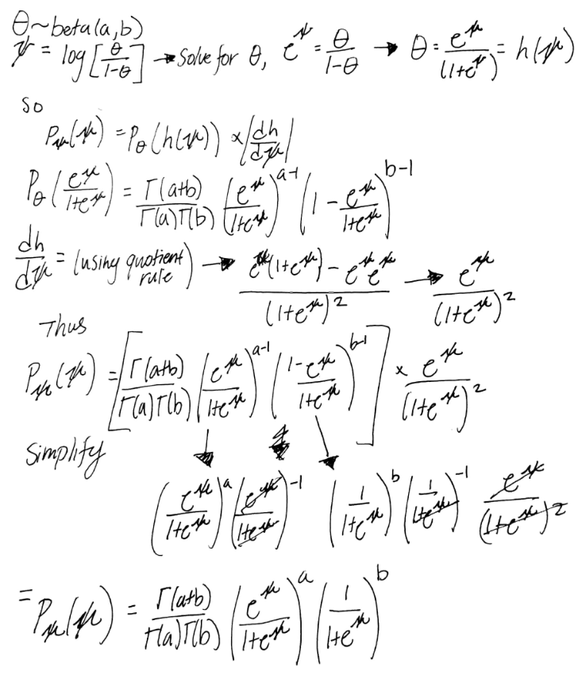
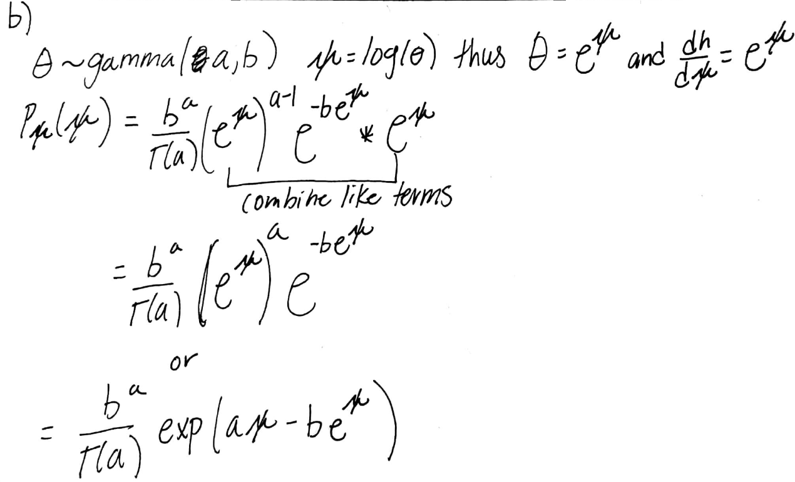
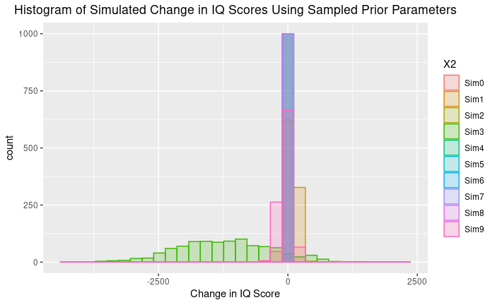

```{r set-up, message = FALSE}
#load in necessary libraries
library(tidyverse)
library(reshape)
```
# Hoff Exercise

a. 
    
```{r graph-part1a}
psipdf = function(psi,a,b){
  (gamma(a+b)/(gamma(a) * gamma(b))) *(exp(psi)    /(1 + exp(psi)))^a * (1/(1+exp(psi)))^b 
} #function from above

psi.sim = seq(-6, 6, length.out = 1000) #create values to graph for psi
psi_density = psipdf(psi.sim, 1, 1) #plug in with a = 1 and b = 1

q1a.df <- data.frame(psi.sim, psi_density) #create data frame for graph
ggplot(q1a.df, aes(psi.sim)) + 
  geom_line(aes(y=psi_density)) + 
labs(title = "Probability Density Function", #graph labels
       x = "psi",
       y = "Probability Density" ) +
    theme(
    panel.grid.major = element_blank(), #erase the grid lines for easier view
    panel.grid.minor = element_blank(),
    ) 
```
b. 
    
```{r graph-part1b}
psipdfb = function(psi,a,b){
  (b^a/(gamma(a))) * exp(a*psi - b*exp(psi))
} #create function that was found above

psi.simb = seq(-5,5, length.out = 1000) #create values for psi
psi_densityb = psipdfb(psi.simb, 1, 1) #plug in values with a = 1, and b = 1 

#Plot density function
q1b.df <- data.frame(psi.simb, psi_densityb) #create second data frame
ggplot(q1b.df, aes(psi.simb)) + 
  geom_line(aes(y=psi_densityb)) +
labs(title = "Probability Density Function", #graph labels
       x = "psi", 
       y = "Probability Density" ) +
    theme(
    panel.grid.major = element_blank(), #erase the grid lines for easier view
    panel.grid.minor = element_blank(),
    ) 
```
    
# Lab Component

a. Task 4
```{r task4}
# spurters
spurters = c(18, 40, 15, 17, 20, 44, 38)
# control group
controls= c(-4, 0, -19, 24, 19, 10, 5, 10,
      29, 13, -9, -8, 20, -1, 12, 21,
      -7, 14, 13, 20, 11, 16, 15, 27,
      23, 36, -33, 34, 13, 11, -19, 21,
      6, 25, 30,22, -28, 15, 26, -1, -2,
      43, 23, 22, 25, 16, 10, 29)

#function that returns mu and lambda from NormalGamma dist
rNormalGamma <- function(k, m , c, a ,b){
  lambda = rgamma(k, shape = a, rate= b)
  mu = rnorm(k, m, sqrt(1/(c * lambda)))
  return(rbind(mu, lambda))
}

#function that calculates updated posterior parameters
normalGammaParams.post <- function(m , c , a , b, X){
  n = length(X)
  M = (m*c + sum(X)) / (c+n)
  C = c + n
  A = a + (n/2)
  B = b + (c*m^2 - C*M^2 + sum(X^2)) /2
  return(list(m = M, c = C, a = A, b = B))
}

#function that calls rNormalGamma with parameters from normalGammaParams.post
rNormalGamma.post <- function(k, m , c , a ,b ,X){
  params = append(list(k = k), normalGammaParams.post(m,c, a, b, X))
  do.call(rNormalGamma, params)
}
#Set our number of samples we are drawing
k = 10^6
#set our prior parameters
prior = data.frame(m = 0, c = 1, a = 0.5, b = 50) 

#Run our simulations for spurters and controls and store results
spurters.postParams.s =
  rNormalGamma.post(k, prior$m , prior$c, prior$a ,prior$b, spurters)
controls.postParams.s =
  rNormalGamma.post(k, prior$m , prior$c, prior$a ,prior$b, controls)

#Generates the posterior probability of mu spurters > mu controls
mean(spurters.postParams.s["mu",] >
       controls.postParams.s["mu",])

```
From the code above, we can see that with N = 1000000 samples from each posterior, we see that the posterior probability of the mean change of the spurters' IQ being greater than the mean change of the controls' IQ is 0.970758. This can be interpreted as, given the data for the spurters and control group, the probability that the mean of the spurters change in IQ is greater than the controls change in IQ is 0.970758. The value of 0.97 is quite high and does provide a strong basis that a teacher's expectations can influence student achievement in a positive way. 

b. Task 5
```{r task5, message = FALSE, warning = FALSE}
# simulation size
sim <- 1000

#initalize vectors to store sample data
mu <- NULL
lambda <- NULL

#get lambda values from gamma function
lambda = rgamma(sim, shape = prior$a, rate = prior$b) 

#get mu values from rnorm using lambda above
mu = sapply(sqrt(1/(prior$c*lambda)), rnorm, n = 1, mean = prior$m) 

simPrior = data.frame(lambda, mu) #create data frame for the simulated prior
simPrior$lambda = simPrior$lambda^{-0.5} #make sure to transform lambda to standard deviation

#Create plot of the mu and lambda values of the 1000 simulations
ggplot(data = simPrior, aes(x = mu, y = lambda)) + 
  geom_point(alpha = 0.5, colour = "darkgreen") + 
  labs(x = expression(paste(mu, " (Mean Change in IQ Score)")),
       y = expression(paste(lambda^{-1/2}, " (Std. Dev. of Change)"))) +
  ggtitle("Prior Samples")+ 
  theme(plot.title = element_text(hjust = 0.5)) + 
  xlim(-50, 50) + ylim(0, 40)
````
```{r eval=FALSE, message=FALSE, warning=FALSE}
#Sample 1000 data points from the latter 10 set of parameters

#create 10 synthetic data sets with 1000 points each
simData = mapply(rnorm, n = 1000, 
                 mean = tail(simPrior$mu, n = 10),  
                 sd = tail(simPrior$lambda, n = 10))
colnames(simData) = paste0("Sim", 0:9)
simData = melt(simData)[,2:3]

#Create plot with overlayed histograms of the synthetic data sets
ggplot(data = simData, aes(x = value, fill = X2, colour = X2)) + 
  geom_histogram(alpha = 0.2, position = "identity") + 
  ggtitle("Histogram of Simulated Change in IQ Using Sampled Prior Parameters") + 
  labs(x = "Change in IQ Score", lab = "Simulation") + 
  theme(plot.title = element_text(hjust = 0.5)) 

#Note, I saved the first generated histogram from the code above as a png file.
#When knitting, it would re-run the code-chunk, resulting in a different histogram.
#So I inserted the one I wrote about as a png file which is included in the zip folder on Sakai.
````  
  
We can see from the plot of the prior samples, that the mean change is centered around 0 with the majority of the points having a standard deviation between 0 and 10 with the rest being dispersed between 10-40.
This matches our prior beliefs quite well as we set m = 0 since we don't know whether students will improve or not, on average. Regarding the standard deviation of change, by selecting a to be (1/2) since we don't know how big the standard deviation of the changes, our resultant standard deviation is 10. Most of the data points above follow our beliefs quite well, of course, not all of them do perfectly as we see some more extreme values such as a negative mean change of 50 and a standard deviation of 40 points.   

Regarding the histograms, we can see that most of the simulations are centered around a 0 point change in IQ score, while 1 simulation (simulation 3) is centered around a -1250 point change, with longer tails that extend out to the 2,5000 range and beyond. The ones centered around 0 have extremely small tails (barely visible). Out of our ten hypothetical data sets, the majority follow our prior beliefs with only 2-3 having longer tails that cover values that don't make any sense such as a -2500 point change in IQ. But for the majority, they follow our beliefs quite well. Overall, we can see that our prior conforms with our selected prior beliefs. 

   
