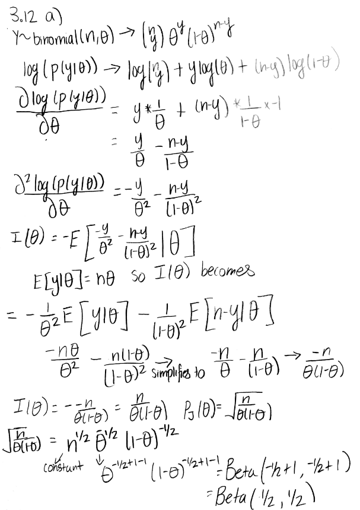
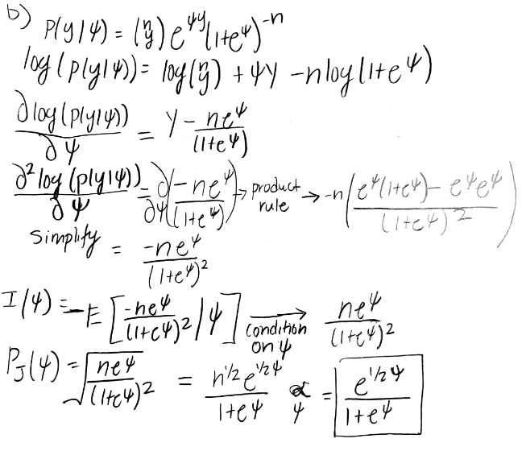
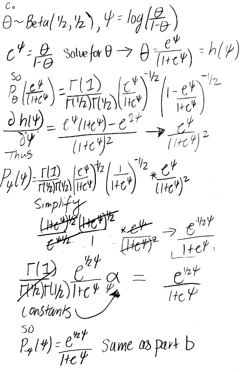

```{r setup, include=FALSE}
knitr::opts_chunk$set(echo = FALSE)
set.seed(1)
```

# Hoff Exercise 3.12
a.  
      
b.  
      
c.  
      


# Lab Component

a. Task 4
```{r task-4, echo=TRUE}
#Code taken from Professor Steort's Lab 5 RMD file

# grid of points
x <- seq(0, 1, 10^-2)

fx <- function(x) sin(pi * x)^2

plot(fx, xlim = c(0,1), ylim = c(0,1.5), ylab = "f(x)", lwd = 2)
curve(dunif, add = TRUE, col = "blue", lwd = 2)
curve(dbeta(x,2,2), add = TRUE, col = "red", lwd = 2)
legend("bottom", legend = c(expression(paste("sin(",pi,"x)"^"2")),"Unif(0,1)",
"Beta(2,2)"), col = c("black", "blue", "red"), lty = c(1,1,1), bty = "n", cex = 1.1, lwd = 2)

sim_fun <- function(f, envelope = "unif", par1 = 0, par2 = 1, n = 10^2, plot = TRUE){
  r_envelope <- match.fun(paste0("r", envelope))
  d_envelope <- match.fun(paste0("d", envelope))
  proposal <- r_envelope(n, par1, par2)
  if(envelope == "norm"){ #if normal, which is the better envelope function
    #multiply dnorm by the constant I chose
    density_ratio <- f(proposal) / (0.605* d_envelope(proposal, par1, par2)) 
  }else{
    #if not normal (uniform or beta), no constant is needed
    density_ratio <- f(proposal) / d_envelope(proposal, par1, par2)
  }
  samples <- proposal[runif(n) < density_ratio]
  acceptance_ratio <- length(samples) / n
  if (plot) {
    hist(samples, probability = TRUE, 
         main = paste0("Histogram of ", 
                       n, " samples from ", 
                       envelope, "(", par1, ",", par2,
                       ").\n Acceptance ratio: ",
                       round(acceptance_ratio,2)), 
                       cex.main = 0.75)
  }
  list(x = samples, acceptance_ratio = acceptance_ratio)
}

par(mfrow = c(2,2), mar = rep(4, 4))

unif_1 <- sim_fun(fx, envelope = "unif", par1 = 0, par2 = 1, n = 10^2) 
unif_2 <- sim_fun(fx, envelope = "unif", par1 = 0, par2 = 1, n = 10^5)

# Add in the Beta(2,2) Histograms with different amount of samples
beta_1 <- sim_fun(fx, envelop = "beta", par1 = 2, par2 =2, n = 10^2)
beta_2 <- sim_fun(fx, envelop = "beta", par1 = 2, par2 =2, n = 10^5)

```
  
From the histograms above, we can see that the more samples taken, the distribution of the accepted values looks more normal with most commonly accepted value being around 0.5. There is more variance with the 100 sample histograms with much more variance in the most commonly accepted value being either a bit higher than 0.5 or a bit lower. The acceptance ratio for the 100,000 samples for both the uniform and beta is 0.5 while the the acceptance ratio of the 100 samples vary more with the uniform having a slightly higher or lower ratio each time you run the code above. However, even with more variance,the acceptance ratio of the 100 samples tends to hover in the range 0f 0.4-.0.5. 

b. Task 5
```{r task-5, echo = TRUE}
#Plot new graph with the normal distribution, beta, and uniform
plot(fx, xlim = c(0,1), ylim = c(0,1.5), ylab = "f(x)", lwd = 2)
curve(dunif, add = TRUE, col = "blue", lwd = 2)
curve(dbeta(x,2,2), add = TRUE, col = "red", lwd = 2)
curve(0.605*dnorm(x, 0.5, 0.22), add = TRUE, col = "green", lwd = 2) #add in normal
legend("bottom", legend = c(expression(paste("sin(",pi,"x)"^"2")),"Unif(0,1)",
"Beta(2,2)", "0.605* Norm(0.5, 0.22)"), col = c("black", "blue", "red", "green"), 
lty = c(1,1,1), bty = "n", cex = 1.1, lwd = 2)

par(mfrow = c(1,2), mar = c(2,1,2,1))
#Adding in the normal distribution histograms
norm_1 <- sim_fun(fx, envelop = "norm", par1 = .5, par2 =.22, n = 10^2)
norm_2 <- sim_fun(fx, envelop = "norm", par1 = .5, par2 =.22, n = 10^5)
```  
  
    
As discussed in task 4, the two functions we chose are about the same when it comes to enveloping f(x). An acceptance ratio of 0.5 is not great and can be costly if you were to run many more samples as only half of the values will be accepted. So, a better enveloping function that I found is a normal function with mean 0.5, standard deviation of 0.22 and multiplied by a constant value of 0.605. With that density, we can see that the acceptance ratio of the 100,000 samples is around 0.84 and with the 100 samples showing , again, more variance, with values (that I've seen from running the code multiple times) from 0.73 to 0.89 which is still higher than both the beta and uniform densities. This is much better because you won't have to reject as many values since you can accept around 84% of the values with the 0.605* Normal(0.5,0.22) density.